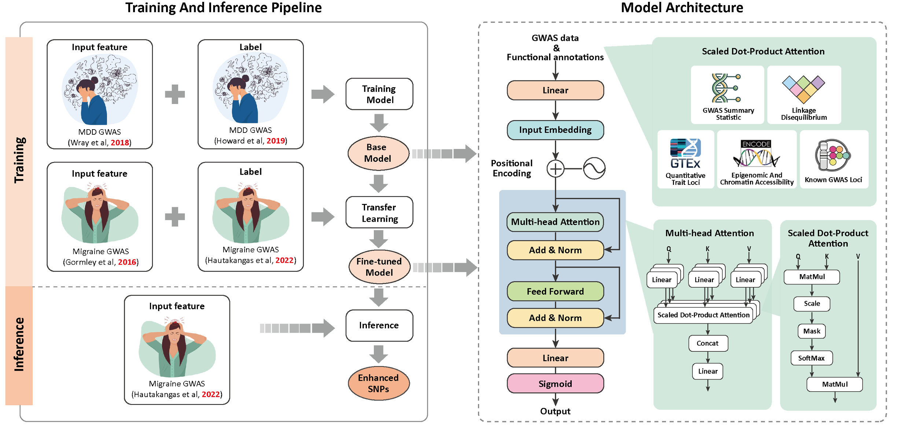

# InsightGWAS: Transformer-Based Model for GWAS Analysis

## Overview

InsightGWAS is a Transformer-based deep learning framework designed to prioritize genetic variants associated with complex diseases using **genome-wide association studies (GWAS) summary statistics** and **multi-modal genomic annotations**.

 **MDD-MA Transformer Model**: Pre-trained on Major Depressive Disorder (MDD) GWAS data and fine-tuned on Migraine (MA) data.

This project consists of four example： Python scripts for training, transfer learning,inference using a Transformer-based model and a baseline(without transfer) learning and inference .

## Required Libraries
Make sure you have the following Python libraries installed:
- torch
- pandas
- scikit-learn
- numpy

## Running the Scripts
Execute the scripts in the following order:
> ⚠️ **Important:** The model architecture parameters (`--num_heads`, `--num_layers`, `--hidden_dim`) **must be the same** as those used during training (`1_train_model.py`) ,transfer learning (`2_transform_learning_model.py`)and inference(`3_inference.py`), otherwise the model will fail to load or behave inconsistently.
1. **Train the initial model on MDD data**

| Argument        | Description                                                    | Default                   |
|-----------------|----------------------------------------------------------------|---------------------------|
| `--data_path`   | Path to the input training dataset (tab-separated `.txt` file) | `data/Train_Data_MDD.txt` |
| `--batch_size`  | Batch size for training                                        | `32`                      |
| `--num_epochs`  | Number of training epochs                                      | `30`                      |
| `--lr`          | Learning rate for the optimizer                                | `0.001`                   |
| `--num_heads`   | Number of attention heads in the Transformer encoder           | `4`                       |
| `--num_layers`  | Number of Transformer encoder layers                           | `2`                       |
| `--hidden_dim`  | Hidden dimension in the feed-forward layers                    | `64`                      |
| `--output_path` | Path to save the trained model checkpoint                      | `model/MDD_model.pth`     |

### 🧪 Example Usage
   ```bash
python train.py 
   ```

2. **Perform transfer learning using MA data**:

### ⚙️ Command-line Options

| Argument | Description | Default |
|----------|-------------|---------|
| `--data_path` | Path to MA training data | `data/Train_Data_MA.txt` |
| `--pretrained_model_path` | Path to the pre-trained MDD model | `model/MDD_model.pth` |
| `--batch_size` | Batch size for training | `32` |
| `--num_epochs` | Number of training epochs | `20` |
| `--lr` | Learning rate for fine-tuning | `0.0001` |
| `--num_heads` | Number of attention heads in Transformer | `4` |
| `--num_layers` | Number of Transformer encoder layers | `2` |
| `--hidden_dim` | Dimension of feedforward network in Transformer | `64` |
| `--output_path` | Path to save the fine-tuned model | `model/MA_transform_learning.pth` |

### 🧪 Example Usage

```bash
python 2_transform_learning_model.py \
```
3. **Run inference**:
### ⚙️ Command-line Options

| Argument | Description | Default |
|----------|-------------|---------|
| `--inference_data_path` | Path to the input MA inference dataset | `data/Inference_Data_MA.txt` |
| `--model_path` | Path to the fine-tuned model checkpoint | `model/MA_transform_learning.pth` |
| `--output_path` | File to save predicted SNPs | `Predicted_SNPs.txt` |
| `--threshold` | Classification threshold (between 0 and 1) | `0.999` |
| `--num_heads` | Number of Transformer heads (must match training) | `4` |
| `--num_layers` | Number of Transformer layers (must match training) | `2` |
| `--hidden_dim` | Transformer feedforward hidden dimension (must match training) | `64` |

### 🧪 Example Usage

```bash
python 3_inference.py
```
After running the inference script, the results will be saved in a file named `Predicted_SNPs.txt`.
   
4. **Run baseline model(without transfer) learning and inference**:
### ⚙️ Command-line Options

| Argument | Description | Default |
|----------|-------------|---------|
| `--train_data_path` | Path to MA training dataset | `data/Train_Data_MA.txt` |
| `--inference_data_path` | Path to MA inference dataset | `data/Inference_Data_MA.txt` |
| `--batch_size` | Batch size | `32` |
| `--num_epochs` | Training epochs | `20` |
| `--lr` | Learning rate | `0.0001` |
| `--num_heads` | Transformer attention heads | `4` |
| `--num_layers` | Transformer encoder layers | `2` |
| `--hidden_dim` | Feedforward hidden dimension | `64` |
| `--threshold` | Prediction threshold | `0.999` |
| `--model_path` | Output path for trained model | `model/MA_baseline.pth` |
| `--output_file` | Path to save predicted SNPs | `Predicted_SNPs_Baseline.txt` |

### 🧪 Example Usage

```bash
python baseline_train_and_infer.py 
```
After running the 4_baseline_learning_inference, the results will be saved in a file named `Predicted_SNPs_Baseline.txt`.

## Note on Example Data
The example data used in these scripts is limited to SNPs from chromosome 6. This is intended for demonstration purposes, and the results do not represent the model's full performance as described in the research paper.

## 🧠 Models from the Study

We have included the exact pretrained models used in our paper:

- `model/transformer_model_mdd.pth`: The model trained on MDD GWAS data.
- `tmodel/ransformer_model_finetuned.pth`: The model after transfer learning on MA GWAS data.

These model checkpoints correspond to the final models evaluated and reported in the manuscript, and are provided to ensure full reproducibility of our results.


## Input Data
The input features for each SNP variant include **GWAS statistics** and **functional annotations**, structured as follows:

| Feature Category         | Description |
|--------------------------|-------------|
| **Genomic Position**     | `chr`, `bpos` (chromosome and base position) |
| **GWAS Summary Stats**   | `beta`, `se`, `p-value`, `sample size (N)` |
| **Regulatory Annotations** | `sQTL`, `eQTL`, `brain eQTL`, `all eQTL`, `mQTL` |
| **Chromatin Features**    | `OCRs (open chromatin regions)`, `encode`, `footprints` |
| **Transcription Factor Binding** | `tfbsConsSites`, `targetScanS.wgRna` |
| **Genomic Evolutionary Features** | `genomicSuperDups`, `CADD score`, `GWAVA score` |
| **LD-related metrics** | `ldscore`, `allele frequency (freq)` |
| **Previous GWAS Evidence** | `reported in previous GWAS` |

## Model Architecture

The Transformer model consists of:
- **Multi-Head Self-Attention**: Captures interactions between SNP features, allowing the model to learn complex regulatory effects.
- **Feed-Forward Neural Networks**: Introduces non-linearity to improve feature learning.
- **Positional Encoding**: Retains order information in feature representations.
- **Binary Classification Output**: Predicts whether an SNP is significantly associated with a disease (0/1 classification).

Each Transformer encoder consists of:
- **4 attention heads**
- **2 layers**
- **Hidden dimension of 64**
- **Fully connected output layer with sigmoid activation**

The model is trained using **binary cross-entropy loss (BCE Loss)** with the Adam optimizer.

## Data Preprocessing
The following preprocessing steps are applied to input data:
1. **Standardization**: GWAS summary statistics and functional annotation scores are standardized using `StandardScaler`.
2. **Train-Test Split**: Data is randomly split into **80% training and 20% validation**.
3. **Data Loading**: Tensor representations are created for efficient training using PyTorch's `DataLoader`.
4. **Class Balancing**: The dataset contains an imbalanced number of positive (disease-associated) and negative SNPs, so **weight adjustments** may be applied.
